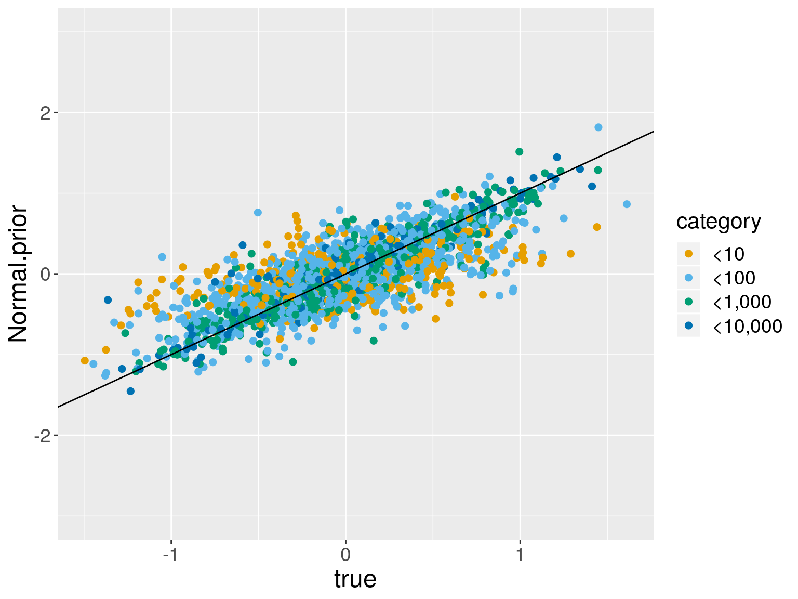
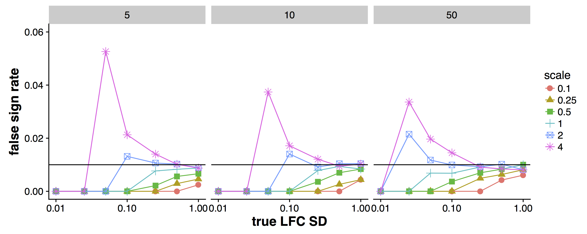
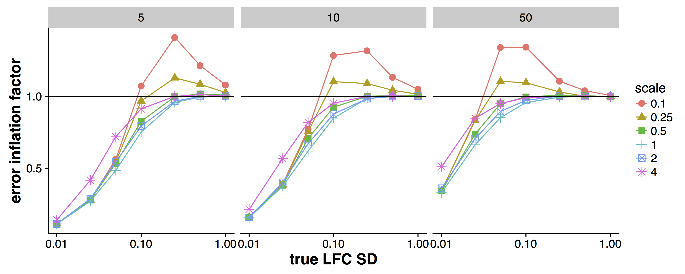
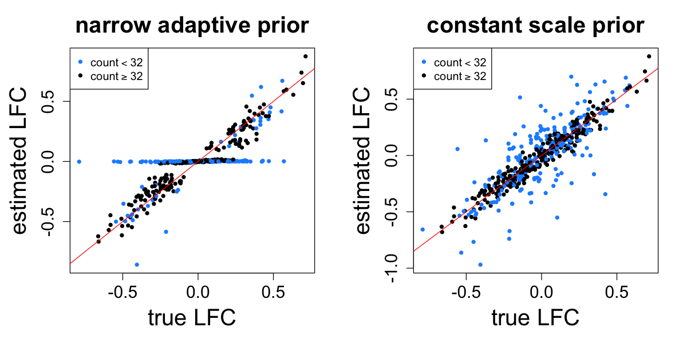
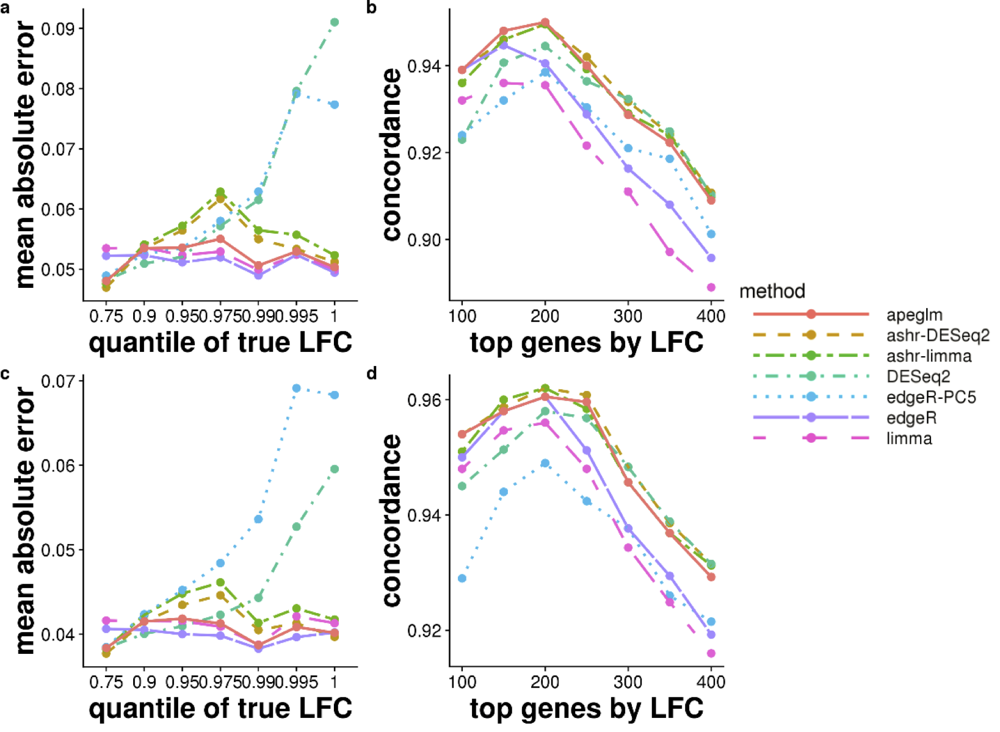

## Work in collaboration with

* Anqi Zhu (UNC-CH)
* Joseph Ibrahim (UNC-CH)

```{r include=FALSE}
knitr::opts_chunk$set(cache=TRUE,
  echo=FALSE, results="hide",
  message=FALSE, warning=FALSE)
```

<style>
.container{
    display: flex;
}
.col{
    flex: 1;
}
</style>

## Aims and activity of the [Love lab](https://mikelove.github.io)

 

* Software and workflows for genomic data science
* Statistical method development
* Collaborations: Genetics, Biology, CS, Statistics

## We often begin with plots

Crucial for high dimensional analysis:

* effect size over mean ("MA" plot)
* SD over mean
* systematic variation (boxplots, PCA)

## Gene expression

* Many collaborations around gene expression:
	- neurons (autism, schizophrenia) *
	- adipose (T2D) *
	- macrophage (arthritis) *
    - colon (IBD) * 
	- breast tumor
    - airway (HIV)
* Often, a *counting* technology
    - Sequencing of cDNA fragments
	- Nanostring
	
\* also interested in chromatin accessibility or conformation

## Log fold change 

Expression of $G$ genes, 5 replicates in 2 groups:

$$[X_{g1}, \dots, X_{g5}] \quad \textrm{vs} \quad [Y_{g1}, \dots, Y_{g5}]$$

$$ E(X_{gi}) = \mu_{gX} $$

$$ E(Y_{gi}) = \mu_{gY} $$

$$ \beta_g \equiv \log_2 \left( \frac{\mu_{gY}}{\mu_{gX}} \right) $$

## Complexities

* Counts $X_{gi}$ and $Y_{gi}$ are actually estimated [1-3]
* Technical artifacts: per-sample scaling factor / offset [4-5]
* Batches and PCR amplification effects
* Dispersion parameter must be estimated [6-8]
* Zero component for highly amplified data [9]

<small>
**References** <br/>
[1] Issue of DGE [@Trapnell2013] <br/>
[2] Bias models [@Patro2017], <br/>
[3] Isoform offset [@Soneson2015], <br/>
[4] TMM [@Robinson2010], <br/>
[5] Median ratio [@Anders2010], <br/>
[6] edgeR GLM [@McCarthy2012], <br/>
[7] DSS [@Wu2012], <br/>
[8] DESeq2 [@Love2014], <br/>
[9] ZI weights [@Berge2018]
</small>

## Effect size in simulated data

* Simulation of over-dispersed count data 
* 2500 "genes", 5 vs 5 replicates

## Effect size over mean ("MA")

```{r}
suppressPackageStartupMessages(library(DESeq2))
m <- 10
n <- 2500
dmr <- function(x) 4/x + exp(rnorm(n,log(.01),2))
set.seed(3)
dds <- makeExampleDESeqDataSet(m=m, n=n, betaSD=.5,
                               interceptMean=5, interceptSD=4,
                               dispMeanRel=dmr)
keep <- rowSums(counts(dds) >= 5) >= 3
keep <- keep & rowMeans(counts(dds)) < 1e4
dds <- dds[keep,]
dds <- DESeq(dds)
normal <- lfcShrink(dds, coef=2, type="normal")$log2FoldChange
grp1 <- rowMeans(counts(dds)[,1:(m/2)])
grp2 <- rowMeans(counts(dds)[,(m/2 + 1):m])
```

```{r ma}
dat <- data.frame(log10mean=log10(.5 * (grp1 + grp2)),
                  log2FoldChange=log2(grp2/grp1),
                  pseudocount.1=log2(grp2+1) - log2(grp1+1),
                  pseudocount.5=log2(grp2+5) - log2(grp1+5),
                  Normal.prior=normal,
                  true=mcols(dds)$trueBeta)
dat$category <- factor(ceiling(dat$log10mean))
levels(dat$category) <- c("<10","<100","<1,000","<10,000")
library(ggplot2)
big.text <- theme(axis.text=element_text(size=14),
                  axis.title=element_text(size=18),
                  legend.text=element_text(size=14),
                  legend.title=element_text(size=16))
rgb2 <- function(x,y,z) rgb(x,y,z,maxColorValue=255)
my.cols <- scale_color_manual(values=cols)
cols <- c(rgb2(230,159,0),rgb2(86,180,233),rgb2(0,158,115),rgb2(0,114,178))
ggplot(dat, aes(x=log10mean, y=log2FoldChange, col=category)) +
  geom_point(size=2) + ylim(-5,5) + geom_hline(yintercept=0, col="black") +
  my.cols + big.text
```

## Estimate over truth

```{r scatter}
ggplot(dat, aes(x=true, y=log2FoldChange, col=category)) + geom_point(size=2) +
  geom_abline(intercept=0, slope=1, col="black") +
  ylim(-3,3) + my.cols + big.text
```

## Faceted by mean

```{r facet}
ggplot(dat, aes(x=true, y=log2FoldChange, col=category)) + geom_point(size=2) +
  geom_abline(intercept=0, slope=1, col="black") + facet_wrap(~category) +
  ylim(-3,3) + my.cols + big.text
```

## Pseudocount 1

```{r facet1}
yvar <- "pseudocount.1"
ggplot(dat, aes_string(x="true", y=yvar, col="category")) +
  geom_point(size=2) +
  geom_abline(intercept=0, slope=1, col="black") +
  facet_wrap(~category) + ylim(-3,3) + my.cols + big.text
```

## Pseudocount 5

```{r facet5}
yvar <- "pseudocount.5"
ggplot(dat, aes_string(x="true", y=yvar, col="category")) +
  geom_point(size=2) +
  geom_abline(intercept=0, slope=1, col="black") +
  facet_wrap(~category) + ylim(-3,3) + my.cols + big.text
```

## Normal prior

```{r facet-normal}
yvar <- "Normal.prior"
ggplot(dat, aes_string(x="true", y=yvar, col="category")) +
  geom_point(size=2) +
  geom_abline(intercept=0, slope=1, col="black") +
  facet_wrap(~category) + ylim(-3,3) + my.cols + big.text
```

## Pseudocount 5

```{r scatter5}
ggplot(dat, aes(x=true, y=pseudocount.5, col=category)) +
  geom_point(size=2) +
  geom_abline(intercept=0, slope=1, col="black") + ylim(-3,3) +
  my.cols + big.text
```

## Normal prior

```{r scatter-normal}
ggplot(dat, aes(x=true, y=Normal.prior, col=category)) +
  geom_point(size=2) +
  geom_abline(intercept=0, slope=1, col="black") + ylim(-3,3) +
  my.cols + big.text
```

## What do we see

<div class="container">

<div class="col">

</div>

<div class="col">
<br/>
With prior:

* Reduced variance
* Genes can be ranked
* Moderate bias

</div>
</div>

## Effect size estimation

* Perhaps we can do better than pseudocount
* Why bother? Just use p-values

## A distribution of effect sizes

* Highly replicated yeast dataset [@Schurch2016]
* 42 vs 44 biological replicates!
* $\Delta snf2$ mutant
    - Catalytic component of the SWI/SNF complex
    - Chromatin-remodeling 
    - Regulation of a large number of genes

## LFC in highly replicated yeast

```{r yeast-ma, echo=FALSE}
load("yeast_res.rda")
res.df <- as.data.frame(res)
res.df$log10mean <- log10(res.df$baseMean)
res.df <- subset(res.df, log10mean > -1)
res.df$FDR.05 <- res.df$padj < .05
res.df$ymin <- with(res.df, log2FoldChange - 2*lfcSE)
res.df$ymax <- with(res.df, log2FoldChange + 2*lfcSE)
ggplot(res.df, aes(log10mean, log2FoldChange, col=FDR.05)) +
  geom_point(alpha=.3) +
  geom_hline(yintercept=0, col="red") +
  scale_color_manual(values=c("black", "red")) + big.text
```

## LFC with 2x SE

```{r yeast-ma2, echo=FALSE, out.width=630, out.height=450}
ggplot(res.df, aes(log10mean, log2FoldChange, col=FDR.05, ymin=ymin, ymax=ymax)) +
  geom_point(alpha=.3) + geom_errorbar(alpha=.3) + 
  geom_hline(yintercept=0, col="red") +
  coord_cartesian(xlim=c(0,5), ylim=c(-2,2)) + 
  scale_color_manual(values=c("black", "red")) + big.text
```

(1700 black, 5100 red)

## Consider utility of p-values

* Null likely false for (nearly) all genes in this example
* Ranking by prob under the null seems non-obvious
* We can estimate the effect size for small or large *n*

## Normal prior in DESeq2

<div class="container">

<div class="col">

</div>

<div class="col">

* MLE coefficients, $\hat{\beta}_g$
* Adapt prior to these
* <font color="red">Normal has thin tails</font>
* Match Normal to upper 5% *weighted* quantile
* Inverse weight by expected variance of log counts

[@Love2014]

</div>
</div>

## Other priors with heavy tails


* ashr [@Stephens2016]
    - $\pi_0 \delta_0 + \sum_{k=1}^K \pi_k N(\cdot; 0, \sigma_k^2)$
    - $\sigma_1, \dots, \sigma_k$ a large, dense, fixed grid
* apeglm [@Zhu2018]
    - Cauchy prior with scale parameter $S$

## Method details

> * ashr:
>     - set $\sigma_k$ grid based on min $\hat{s}_g$ and max $\hat{\beta}_g^2 - \hat{s}_g^2$
>     - estimate $\pi_k$ using $\hat{\beta}_g$ and $\hat{s}_g$
>     - $P(\hat{\beta}_g | \beta_g, \hat{s}_g) = N(\hat{\beta}_g; \beta_g, \hat{s}_g^2)$
>     - return the posterior mean, SD
> * apeglm: 
>     - set the scale $S$ of Cauchy using $\hat{\beta}_g$ and $\hat{s}_g$
>     - use data $Y_g$, parameters $\theta_g$, likelihood (NB, ZINB, etc.)
>     - return the posterior mode, SD

## Connection to bayesglm

* Fixed 2.5 scale Cauchy prior 
* Posterior mode and SE via an approximate EM within IRLS

[@Gelman2008]

## Connection to bayesglm

* "*want something better than the unstable estimates produced by the
  current default - maximum likelihood*" 
* "*[Cauchy] allows for occasional large coefficients while still
  performing a reasonable amount of shrinkage for coefficients near
  zero*" 

[@Gelman2008]

## apeglm implementation

**A**pproximate **P**osterior **E**stimation for **GLM**

* Prior fit to $\hat{\beta}_g$ and $\hat{s}_g$
* C++ version of L-BFGS-B to obtain posterior mode 
    - <1 s for 10k genes
* `optim` to obtain Hessian for Laplace approximation 
    - ~3 s

---

Solve for $A$ in equation of the  form [@EfronMorris]

$A = f(A, \hat{\beta}_g^2, e_g^2)$

Motivated by the following hierarchical model:

$$ \hat{\beta}_g \sim N(\beta_g, e_g^2) $$

$$ \beta_g \sim N(0, A) $$

Two approximations to note:

> 1. We plug in $\hat{s}_g^2$ for $e_g^2$
> 2. Estimate scale of a *Normal* then use a *Cauchy*

## False Sign Rate (FSR)

* p-value*
* adjusted p-value
* q-value
* local false discovery rate
* local false sign rate*
* s-value

```{r pvalue, echo=FALSE, fig.width=7, fig.height=2.5}
par(mfrow=c(1,3))
s <- seq(from=-4,to=4,length=100)
plot(s, dnorm(s), type="l", xlab="", ylab="", main="p-value")
segments(2, 0, 2, dnorm(2), lwd=2)
polygon(c(2,20:40/10,4),
        c(0,dnorm(20:40/10),0),
        col=rgb(1,0,0,.5))
polygon(c(-2,-20:-40/10,-4),
        c(0,dnorm(-20:-40/10),0),
        col=rgb(1,0,0,.5), density=50)
plot(s, .9*dnorm(s), type="l", ylim=c(0,.37), xlab="", ylab="", main="local fdr")
lines(s, .9*dnorm(s) + .1*dnorm(s,2),col="blue")
segments(2, 0, 2, .9*dnorm(2)+.1*dnorm(2,2), lwd=2, col="blue")
segments(2, 0, 2, .9*dnorm(2), lwd=2)
plot(s, dnorm(s,2), type="l", xlab="", ylab="", col="purple", main="local fsr")
segments(0, 0, 0, dnorm(0,2), lwd=2)
segments(2, 0, 2, dnorm(2,2), lwd=2, col="purple", lty=3)
polygon(c(0,0:-40/10,-4),
        c(0,dnorm(0:-40/10,2),0),
        col=rgb(1,0,1,.5))
```

## Prior scale & False Sign Rate (FSR)



## Prior scale & estimation error



## Prior scale & estimation error



## Return to yeast example

### 3 vs 3 replicates

## Yeast with Normal prior

```{r echo=FALSE}
load("yeast_res.rda")
load("yeast_dds.rda")
idx <- c(which(dds$condition=="WT")[1:3],
         which(dds$condition=="mut")[1:3])
dds2 <- dds[,idx]
dds2 <- DESeq(dds2)
res2 <- lfcShrink(dds2, coef=2, type="normal")
sub.df <- data.frame(true=res$log2FoldChange,
                     Normal.prior=res2$log2FoldChange,
                     mean=res$baseMean)
cleanIt <- function(sub.df) {
  sub.df <- sub.df[!is.na(sub.df$true),]
  sub.df$type <- factor(ifelse(abs(sub.df$true) < 2, "small.LFC",
                        ifelse(sub.df$mean < 20, "small.mean",
                               "large.mean")),
                        c("small.LFC","small.mean","large.mean"))
  sub.df
}
```

```{r yeast-normal, echo=FALSE}
yeast_x_axis <- scale_x_continuous(breaks=(-4:2) * 2, limits=c(-8,4))
yeast_y_axis <- scale_y_continuous(breaks=-4:2 * 2, limits=c(-8,4))
sub.df <- cleanIt(sub.df)
ggplot(sub.df, aes(true, Normal.prior, col=type)) +
  geom_point(alpha=.3, size=3) +
  geom_abline(slope=1, intercept=0, col="red") +
  yeast_x_axis + yeast_y_axis + 
  scale_color_manual(values=c("black", "orange3", "blue")) + big.text
```

## Yeast with apeglm

```{r yeast-ape, echo=FALSE}
res2 <- lfcShrink(dds2, coef=2, type="apeglm")
sub.df <- data.frame(true=res$log2FoldChange,
                     Cauchy.prior=res2$log2FoldChange,
                     mean=res$baseMean)
sub.df <- cleanIt(sub.df)
ggplot(sub.df, aes(true, Cauchy.prior, col=type)) +
  geom_point(alpha=.3, size=3) +
  geom_abline(slope=1, intercept=0, col="red") +
  yeast_x_axis + yeast_y_axis + 
  scale_color_manual(values=c("black", "orange3", "blue")) + big.text
```

## Yeast with ashr

```{r yeast-ashr, echo=FALSE}
res2 <- lfcShrink(dds2, coef=2, type="ashr")
sub.df <- data.frame(true=res$log2FoldChange,
                     ashr.prior=res2$log2FoldChange,
                     mean=res$baseMean)
sub.df <- cleanIt(sub.df)
ggplot(sub.df, aes(true, ashr.prior, col=type)) +
  geom_point(alpha=.3, size=3) +
  geom_abline(slope=1, intercept=0, col="red") +
  yeast_x_axis + yeast_y_axis + 
  scale_color_manual(values=c("black", "orange3", "blue")) + big.text
```

## What else are we doing

* [tximeta](https://bioconductor.org/packages/tximeta) - automatic
  detection of gene provenance ([slides](https://bit.ly/tximeta))
* [rnaseqDTU](https://bioconductor.org/packages/rnaseqDTU) - workflow
  for differential transcript usage
* Propagation of uncertainty at transcript-level
* [Multi-omics unsupervised benchmark](https://doi.org/10.1101/379115) (McCabe)
* Germline analysis in Carolina Breast Cancer Study (Bhattacharya)

## Simplify statistical routines

```{r echo=TRUE, eval=FALSE}
# import the data
se <- tximeta(samples)
gse <- summarizeToGene(se)

# build dataset
dds <- DESeqDataSet(gse, ~batch + condition)

# variance stabilization
vsd <- vst(dds)

# size factors, dispersion estimation
dds <- DESeq(dds)

# shrinkage estimation
res <- lfcShrink(dds, coef=3)
```

---

**Paper and software**

* [apeglm preprint](https://doi.org/10.1101/303255) on bioRxiv
  (accepted at *Bioinformatics*)
* `lfcShrink(dds, coef=2, type="apeglm")`
* `lfcShrink(dds, coef=2, type="ashr")`

**Acknowledgments**

* Work by **Anqi Zhu** and Joseph Ibrahim
* Comments from Wolfgang Huber and Cecile Le Sueur 
* Funding:
    - MIL - R01 HG009125, P01 CA142538, P30 ES010126
    - JGI and AZ - R01 GM070335 and P01 CA142538

## Previous work on LFC shrinkage in RNA-seq

* ShrinkBayes [@vandewiel2012;@vandewiel2014]
    - shrinkage of many parameters simultaneously
    - non-equal mixture proportions for + and - effects
	- spike + parametric,  spike + non-parametric
    - Integrated Nested Laplace Approximation `INLA`

## Connection to dispersion prior

* [DSS](https://doi.org/10.1093/biostatistics/kxs033) - model log
  dispersion as Normal. **Method of moments** estimator 
  and **simulation** to define hyper-parameters
* [DESeq2](https://doi.org/10.1186/s13059-014-0550-8) - model log
  dispersion as Normal. **Cox-Reid** estimator and **closed form** to
  define hyper-parameters 
* [BASiCS](https://doi.org/10.1016/j.cels.2018.06.011) - model log
  dispersion with Student's *t*
  
$$ \log(\delta_g) \sim f(\mu_g) + \varepsilon, \quad \varepsilon \sim t_\nu(0,\sigma^2) $$

"*here we opt for a Student-t distribution as it leads to inference
that is more robust to the presence of outlier genes*" 

## Connection to bayesglm

Cauchy can be modeled as a mixture of Normals:

$$ \beta \sim N(0, \sigma^2) $$

$$ \sigma^2 \sim \textrm{Scale-inv-} \chi^2(\nu, S^2) $$

* $\nu=1$ and $S=2.5$ are fixed 
* Within IRLS, perform an EM step
* Treat $\beta$ as missing data, estimate $\sigma$

[@Gelman2008]

## Problem case for apeglm

---

```{r echo=FALSE}
m <- 4
n <- 3200
dmr <- function(x) 1/x + exp(rnorm(n,log(.05),1))
set.seed(1)
betaSD <- rep(c(0,1),c(3000,200))
dds <- makeExampleDESeqDataSet(m=m, n=n, betaSD=betaSD,
                               interceptMean=5, interceptSD=4,
                               dispMeanRel=dmr)
mcols(dds)$betaSD <- betaSD
keep <- rowSums(counts(dds) >= 5) >= 3
keep <- keep & rowMeans(counts(dds)) < 1e4
dds <- dds[keep,]
dds <- DESeq(dds, fitType="mean")
apeglm <- lfcShrink(dds, coef=2, type="apeglm")$log2FoldChange
ashr <- lfcShrink(dds, coef=2, type="ashr")$log2FoldChange
dat <- data.frame(log10mean=rep(log10(mcols(dds)$baseMean),2),
                  estimate=c(apeglm,ashr),
                  method=rep(c("apeglm","ashr"),each=nrow(dds)),
                  true=rep(mcols(dds)$trueBeta,2),
                  category=factor(paste0("betaSD:",rep(mcols(dds)$betaSD,2))))
```

```{r apeglm-limit, echo=FALSE, fig.width=7, fig.height=3}
ggplot(dat, aes(x=true, y=estimate, col=category)) +
  geom_point(alpha=.3,size=2) +
  geom_abline(slope=1, intercept=0, col="black") +
  scale_color_manual(values=c("black", "blue")) + 
  big.text + facet_wrap(~method) + ggtitle("apeglm limitation: n=2 vs 2, spike at 0")
```

```{r apeglm-limit2, echo=FALSE, fig.width=7, fig.height=3}
ggplot(dat, aes(x=log10mean, y=estimate, col=category)) +
  geom_point(alpha=.3,size=2) +
  big.text + facet_wrap(~method) +
  scale_color_manual(values=c("black", "blue")) + 
  ggtitle("apeglm limitation: n=2 vs 2, spike at 0")
```

## Error and concordance for various methods

### Extra slides / see paper

## Yeast: n=3 and n=5


## Simulation: n=5 and n=10


## Simulation: n=30 and n=50



---

<font size="-2">

